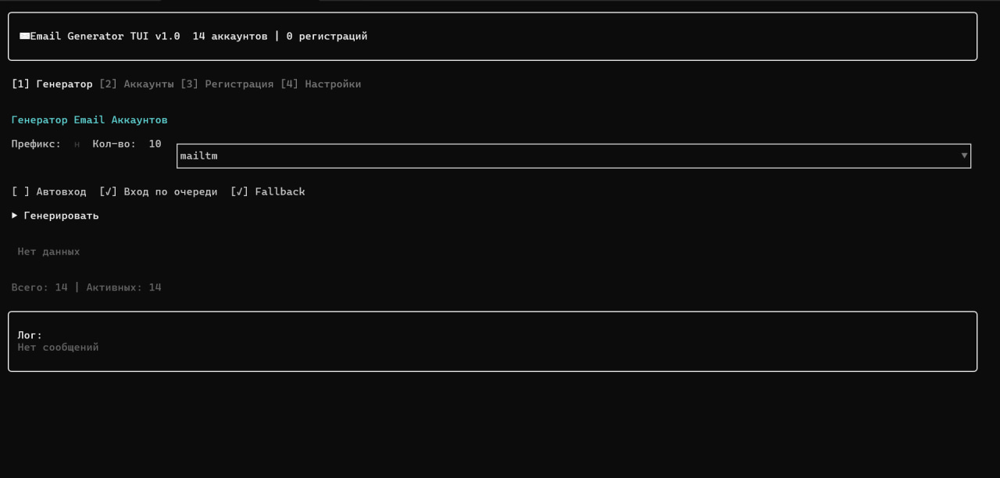

# MailGen TUI

Консольный генератор одноразовых email-аккаунтов с интерфейсом в терминале.



## Возможности

- Генерация email-аккаунтов через встроенные провайдеры
- Массовое создание с настраиваемым префиксом и количеством
- Автоматическая регистрация на сайтах
- Хранение и экспорт аккаунтов
- Встроенный лог所有情节 операций

## Провайдеры

| Провайдер | Описание |
|-----------|----------|
| **mailtm** | Mail.tm — бесплатные почтовые ящики |
| **tempmail** | Guerrilla Mail — одноразовая почта |

## Установка

### Скачать готовый exe

Перейди в [Releases](https://github.com/merfiDEV/mailgen-tui/releases) и скачай `luagen.exe`.

### Собрать самому

```bash
git clone https://github.com/merfiDEV/mailgen-tui.git
cd mailgen-tui
npm install
npm run build
npm run build:exe
```

## Использование

```
luagen.exe
```

### Горячие клавиши

| Клавиша | Действие |
|---------|----------|
| `1-4` | Переключение вкладок |
| `Enter` | Выбор / действие |
| `Space` | Включение/отключение опции |
| `q` / `Esc` | Выход |

### Вкладки

1. **Генератор** — создание email-аккаунтов
2. **Аккаунты** — просмотр и управление аккаунтами
3. **Регистрация** — автоматическая регистрация на сайтах
4. **Настройки** — конфигурация приложения

## Настройки

Конфигурация хранится в `config.json`:

```json
{
  "browserType": "chromium",
  "maxThreads": 3,
  "emailProviderPriority": ["mailtm", "tempmail"],
  "proxyEnabled": false
}
```

## Стек

- [Glyph](https://github.com/nicholasgasior/glyph) — React для терминала
- [Bun](https://bun.sh) — сборка в standalone exe
- TypeScript

## Лицензия

MIT
